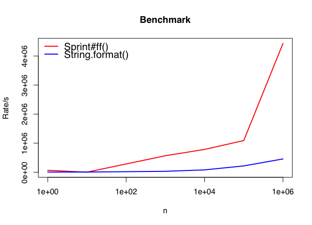

sprint
======


Fluent, small and fast String formatter for Java.

Synopsis
--------

```java
final Sprint sprint = new Sprint();
System.out.Println(sprint.ff("Hello: {}!", "John")); // => Hello: John!
```

Description
-----------

sprint is a formatter for String.

This library provides a formating method `ff`,
this method formats String according to fluent (or loose?) template like `"{}:{}"`.
`{}` is a placeholder to fill any arguments.
This method takes arguments after template and fill those into placeholder.

This method parses template __only at once__.
Parsed structure is stored on ConcurrentHashMap which is contained in instance of Sprint.
When it formats String with the same template, it uses pre-parsed structures from the second time.

Benchmark
---------

Benchmark project is [here](https://github.com/moznion/sprint-bench). This is a result of jdk1.8.0\_92.



### n=10000

```
Score:

sprintff:  0 wallclock secs ( 0.01 usr +  0.00 sys =  0.01 CPU) @ 798977.31/s (n=10000)
stringFormat:  0 wallclock secs ( 0.11 usr +  0.01 sys =  0.13 CPU) @ 77924.71/s (n=10000)

Comparison chart:

                    Rate  sprintff  stringFormat
      sprintff  798977/s        --          925%
  stringFormat   77925/s      -90%            --
```

### n=100000

```
Score:

sprintff:  0 wallclock secs ( 0.06 usr +  0.03 sys =  0.09 CPU) @ 1143850.66/s (n=100000)
stringFormat:  0 wallclock secs ( 0.50 usr +  0.00 sys =  0.51 CPU) @ 197784.81/s (n=100000)

Comparison chart:

                     Rate  sprintff  stringFormat
      sprintff  1143851/s        --          478%
  stringFormat   197785/s      -83%            --
```

Hints
--

This class should be used as singleton because cache of parsed result of template is stored on __instance__ field

TODO
----

- `sprintf` compatible template

Author
------

moznion (<moznion@gmail.com>)

License
-------

```
The MIT License (MIT)
Copyright © 2016 moznion, http://moznion.net/ <moznion@gmail.com>

Permission is hereby granted, free of charge, to any person obtaining a copy
of this software and associated documentation files (the “Software”), to deal
in the Software without restriction, including without limitation the rights
to use, copy, modify, merge, publish, distribute, sublicense, and/or sell
copies of the Software, and to permit persons to whom the Software is
furnished to do so, subject to the following conditions:

The above copyright notice and this permission notice shall be included in
all copies or substantial portions of the Software.

THE SOFTWARE IS PROVIDED “AS IS”, WITHOUT WARRANTY OF ANY KIND, EXPRESS OR
IMPLIED, INCLUDING BUT NOT LIMITED TO THE WARRANTIES OF MERCHANTABILITY,
FITNESS FOR A PARTICULAR PURPOSE AND NONINFRINGEMENT. IN NO EVENT SHALL THE
AUTHORS OR COPYRIGHT HOLDERS BE LIABLE FOR ANY CLAIM, DAMAGES OR OTHER
LIABILITY, WHETHER IN AN ACTION OF CONTRACT, TORT OR OTHERWISE, ARISING FROM,
OUT OF OR IN CONNECTION WITH THE SOFTWARE OR THE USE OR OTHER DEALINGS IN
THE SOFTWARE.
```

